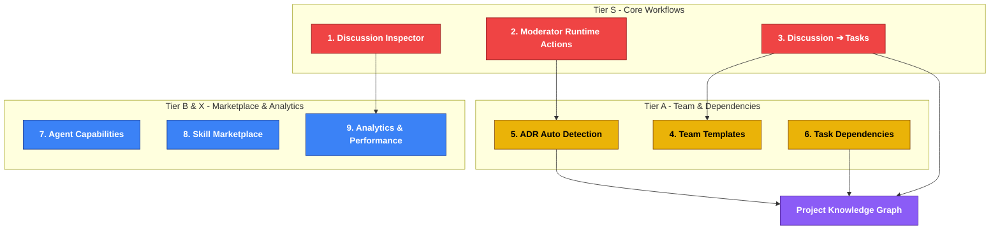

# ROOM Proposed Features & Roadmap

This document outlines the proposed features, roadmap priorities, and architecture decisions for **ROOM** to support its evolution as a context-driven multi-agent workspace.

---

## 🚀 Priority Roadmap Summary

Below is the recommended roadmap priority to keep ROOM focused on proving its core workflow before introducing complex architecture like full vector databases or parallel agents:



---

## 🏆 Tier S (Must-Have First)

These features focus on making the collaborative agent workflows inspectable, actionable, and transitionable.

### 1. Discussion Inspector (SSS Rank)
> **Status: Implemented** — reference tracing protocol + Inspector panel in Discussions.

Currently, it is difficult to determine if agents are truly collaborating and referencing prior inputs, or if they are executing in isolation.
* **Goal**: Visualizing the flow of context references between agents within a session.
* **UI Representation**:
  ```text
  Session
  └── Loop 1
      ├── Researcher
      │   └── Used:
      │       - User
      ├── Writer
      │   └── Used:
      │       - Researcher
      └── Editor
          └── Used:
              - Researcher
              - Writer
  ```
* **Engine Prompt Upgrade**: Add prompt parameters to enforce tracing:
  ```text
  Before answering, output:
  
  Referenced Messages:
  - <author/message ID>
  
  Reason:
  - <why this message was referenced>
  ```
  The engine will parse this block to build the reference inspector tree.

### 2. Moderator Runtime Actions
> **Status: Implemented** — room-action blocks executed by the quality gate (continue/stop/create_task/create_adr).

Currently, the Moderator exists purely as text/instructions. It should be upgraded to emit structural runtime actions that the engine executes programmatically.
* **Goal**: Allow the Moderator to control the task lifecycle.
* **Actions**:
  * `{"action": "continue"}`: Proceeds to the next agent turn/cycle.
  * `{"action": "stop"}`: Halts execution.
  * `{"action": "create_task"}`: Programs a new task card.
  * `{"action": "create_adr"}`: Generates an Architecture Decision Record (ADR).

### 3. Discussion ➔ Task (First-Class Feature)
> **Status: Implemented** — "Generate Tasks (AI)" creates an Epic→Task→Subtask board at .room/tasks/board.json.

Provide a clear transition from collaborative conversation to structured implementation.
* **Goal**: Click a single button at the end of a discussion to automatically generate structural task boards.
* **Output Hierarchy**:
  ```text
  Epic (Discussion Outcome)
   └── Task (Feature Specs)
        └── Subtask (Implementation items)
  ```

---

## 🌟 Tier A (High Value Add)

Features targeting team setups and logical relationships within project files.

### 4. Team Templates
Allows users to instantiate pre-configured agent teams with one click.
* **Film/Creative Team**: `Researcher` ➔ `Writer` ➔ `Story Editor` ➔ `Moderator`
* **Product Team**: `Product` ➔ `UX` ➔ `Architect` ➔ `QA`
* **Development Team**: `Architect` ➔ `Implementer` ➔ `Security` ➔ `QA`

### 5. Task Dependencies
Replaces the flat task list with a tree structure to model complex build pipelines.
* **Hierarchical Tasks**:
  ```text
  Task A
   ├─ Task A.1
   ├─ Task A.2
   └─ Task A.3
  ```
* **Relation Constraints**: Support for `Blocked By` and `Depends On`.

### 6. ADR Auto Detection
Automatic recommendation of architectural records during natural discussions.
1. User mentions: *"We will use SQLite."*
2. Moderator detects: *"Decision Detected: Change in storage layer."*
3. Prompt/UI offer: *"Create ADR-003: SQLite transition?"*

---

## 📈 Tier B & X (Scale & Analytics)

Features focused on agent efficiency, skill extensions, and performance monitoring.

### 7. Agent Capability System
Extends the current simple skill strings array with high-level agent permissions and capabilities.
```json
{
  "capabilities": [
    "research",
    "review",
    "create_task"
  ]
}
```
* **Purpose**: Helps the Moderator dynamically delegate roles based on who is capable of what.

### 8. Skill Marketplace & Recommendations
* **Marketplace**: Drag-and-drop skills (e.g., `product-discovery`, `inventory-management`) from a library straight onto agents.
* **Recommendations**: As user types *"Build POS application"*, ROOM recommends enabling `inventory-management` and `barcode-design` skills.

### 9. Agent Performance Analytics (Tier X)
Gathers long-term telemetry on agent execution quality:
* **Researcher**: *Used 42 times, Accepted 39, Rejected 3*
* **Writer**: *Used 30 times, Referenced Others 28*
* **Insight**: Reveals which agent personas and skills provide the highest actual utility.

---

## 🎯 The Killer Feature: Project Knowledge Graph

Instead of building generic AI chatbots, ROOM's unfair advantage is maintaining the **integrated lifecycle graph** of a project.

```text
Discussion #12 (Idea)
       │
       ▼
  ADR #3 (Decision)
       │
       ▼
  Task #44 (Plan)
       │
       ▼
  Artifact #9 (Code/Outcome)
```

### 🔗 Why this wins:
Existing tools (Jira, Notion, Slack, GitHub, Linear) fail to bridge the context gap. By providing a clickable, traceable link from code artifacts back through tasks, decisions, and original agent discussions, ROOM solves the ultimate problem in software development: **Project Memory & Shared Context**.
